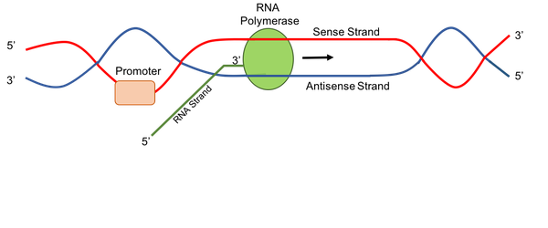
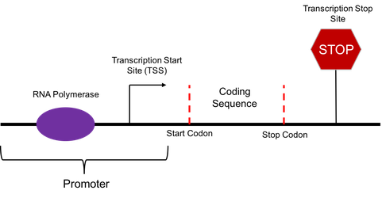
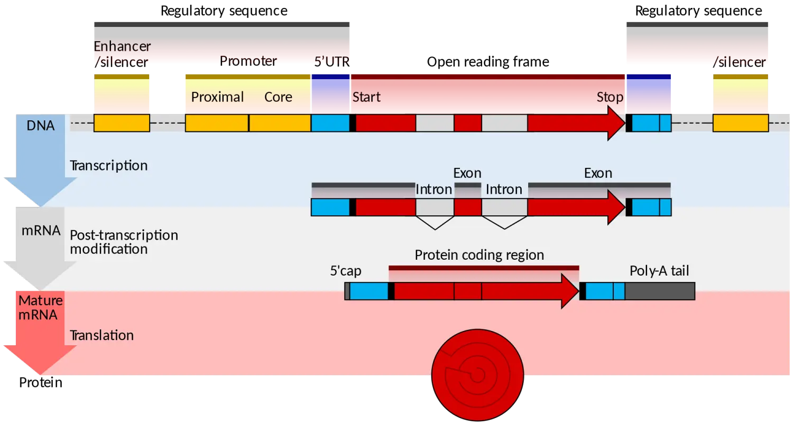
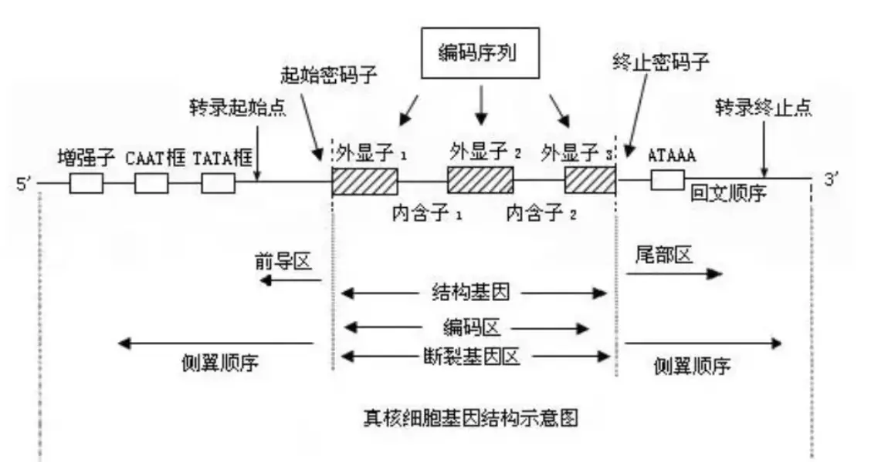

# 中心法则与基因序列
---

## 一、基因表达的中心法则
### 1.基因指定功能性产物

一个DNA分子不仅仅是一长串乏味的核苷酸。相反，它被划分成了一个个功能单元，称为**基因**。每个基因都为一个功能性产物的生成提供指令，功能性产物是在细胞里完成一项工作所需的分子。在许多情况下，基因的功能性产物是蛋白质。例如，孟德尔的花色基因为一种蛋白质提供了指令，这种蛋白质在花瓣中帮助合成有颜色的分子（色素）。

如上图所示，一个生物的DNA可以划分成很多称为基因的功能单位。 每个基因都由DNA序列组成，这些序列提供了制造细胞所需物质的指令。 有些产物是多肽，另一些产物则是功能性RNA。

**多肽**其实就是氨基酸链的另一种说法。很多蛋白质是一条多肽链组成的，不过也有一些是由多条链组成的。给生产多肽提供指示的基因叫做**蛋白质编码基因**。
一些功能性RNA（例如转运RNA和核糖体RNA）已经被发现多年。然而，科学家最近才发现很多其他的基因也编码调控RNA，这些非蛋白编码RNA可以改变其他基因的表达。

**注意:**
一个DNA分子上有许多基因，并非所有基因的编码区都在同一条单链上（大概50%的基因的模板链位于正链上，另外的位于反链上），因此模板链或编码链是相对某个基因的转录而言的。

### 2.基因指示蛋白质生成过程

 - 转录，一个基因的DNA序列被复制，形成一个RNA分子。这一步叫做转录， 因为它涉及到用相似的RNA“字母表”重写或转录DNA序列。在 真核生物 中，RNA分子必须经过加工才能变成一个成熟的信使RNA （mRNA）。

- 翻译，mRNA序列被解码，指示一个多肽的氨基酸序列的生成。翻译这个名字反映了mRNA序列的核苷酸序列必须被翻译成另一个完全不一样的氨基酸“语言”。

所以，在蛋白质编码基因的表达中，信息流为DNA——>RNA——>蛋白质。这个有固定方向的信息流被称为分子生物的**中心法则**。非蛋白质编码的基因（指示功能性RNA生成的基因）也被转录生产出一个RNA分子，但这个RNA不会被翻译成多肽。对于这两种基因，从DNA到功能性产物的过程称为**基因表达**。

## 二、转录阶段
### 1.转录
转录（Transcription）
: 是在RNA聚合酶的催化下，遗传信息由DNA复制到RNA（尤其是mRNA）的过程。作为蛋白质生物合成的第一步，转录是合成mRNA以及非编码RNA（例如tRNA、rRNA等）的途径。

在转录中，构成基因的DNA中的一条链称为**非编码链（模板链，非有义链-antisense strand）**，它在通过RNA聚合酶合成配对（互补）RNA链时作为模板。这条RNA链被称为初级转录产物。

初级转录产物携带着的序列信息与那条没有被转录的DNA链相同，那条DNA链有时被称为**编码链（有义链-sense strand，非模板链，密码股）**。不过由于DNA和RNA之间生物化学上的差别，初级转录产物和DNA的编码链并非完全相同。一个重要的不同在于RNA分子不包括碱基胸腺嘧啶（T）。它们用相似的碱基 尿嘧啶（U）代替。与胸腺嘧啶相同，尿嘧啶和鸟嘌呤配对。

RNA聚合酶
: 转录中涉及的主要的酶是RNA聚合酶，其使用一个单链DNA模版去合成一个互补的RNA链。特别地，RNA聚合酶由5‘到3’方向构建RNA链，在链的3‘末端添加每一个新的核苷酸。

### 2.转录和RNA加工
在细菌中，初级RNA转录产物可以直接作为 信使RNA，或mRNA。信使RNA之所以得名，是因为它们是DNA和核糖体之间的信使。核糖体是细胞质中由RNA和蛋白质组成的结构，而蛋白质正是在细胞质中生产出来的。

在真核生物（例如人类）中，初级转录产物需要经历一些额外的加工步骤才能成为一个成熟的mRMA。在加工过程中，mRNA的两端被加上“帽子”，一部分也许会在叫做剪切的过程中被小心地移除。这些步骤不在细菌中发生。

原核生物和真核生物的转录位置也不同。真核生物的转录发生在细胞核中，DNA被储存的地方，而蛋白质合成发生在细胞质中。因此，一个真核信使RNA必须从细胞核中运出来才能被翻译成多肽。而原核细胞没有细胞核，所以它们的转录和翻译都在细胞质中进行。

首先在转录发生之前，DNA双螺旋必须在被转录的基因附近解开，解开的DNA区域称为**转录泡**。

DNA上第一个RNA核苷酸被转录的位点称为**+1位点，或起始位点**。在起始位点之前的核苷酸为负数，并被认为是**上游** 。起始位点之后的核苷酸为正数，并被认为是**下游**。

转录的三个阶段
: 
* **起始** RNA聚合酶与一段称为启动子的DNA序列结合。该序列被发现离基因的开头很近。每个基因（或在细菌中，每组被同时转录的基因）都有它们自己的启动子。一旦结合，RNA 聚合酶分离 DNA 链，提供转录所需的单链模板。

* **延伸** 一条DNA模版链作为RNA聚合酶的模版。当聚合酶一个一个地“读取”这个模板的碱基时，它用互补的核苷酸建立RNA分子，产生一个从5‘到3’生长的链。RNA转录物与非模版的DNA（编码）链带有相同的信息，但它含有碱基尿嘧啶（U）而不是胸腺嘧啶（T）。

* **终止** 被称为终止子的序列标志着RNA转录的完成。一旦它们被转录完，转录物被从RNA聚合酶释放。一个终止的机理涉及在RNA发夹的形成，如下所示。

### 3.真核生物的mRNA前体修饰

在细菌中，RNA转录物可以立即成为信使RNA（mRNA）。在真核生物中，编码蛋白基因的转录物被称为mRNA前体，在被直接翻译前必须经历额外的处理。

* 真核mRNA前体的末端必须被修改，通过添加一个5'帽子（在开头）和3‘多聚-A尾巴（在末尾）。
* 许多真核mRNA前体会经历剪切。在这个过程中，mRNA前体的一些部分（叫内含子）被切掉，而剩下的（叫外显子）被粘回在一起。

末端修饰提高了mRNA的稳定性，而剪切带给mRNA正确的序列。（如果内含子没有被移除，它们会与外显子一起被翻译，产生“胡言乱语”的多肽。）

### 4.个别基因的转录时机

不是所有基因都在所有时间被转录。相反，每个基因的转录都被单独控制（或者，在细菌中，在同一小组内基因被同时转录）。细胞仔细地调控转录，只转录那些其产物在特定时刻被需要的基因。

例如，下图显示了一个想象的细胞的RNA在一定时刻的“快照”。在这个细胞中，基因1、2和3被转录，而基因4没有。另外，基因1、2和3被不同程度地转录，意味着每个基因都有不同的RNA分子数。

### 5.转录起始位点详细解释

#### 5.1 基本概念
* 开放阅读框（ORF：open reading frame）
是理论上的蛋白编码区，一般是现在DNA序列中寻找起始密码子AUG对应的序列ATG，然后按照每3个碱基一组向后延伸，一直到出现终止密码子（UAG,UCG,UAA）对应的序列。

* 编码区（CDS,coding sequences）是与蛋白序列一一对应的DNA序列，并且序列中间不存在其他与蛋白无关的序列，和真实情况最接近。

* 正链和负链（forward和reverse strand）：因为DNA是双链的，对于一个参考基因组，一条链被指定为正链（forward strand），那么另一条就是反链，只是为了研究方便而统一命名规则。

* 转录起始位点(Transcription Start Site, TSS)是指一个基因的5’端转录的第一个碱基，它是转录时，mRNA链第一个核苷酸相对应DNA链上的碱基，通常是一个嘌呤(A或G)。
通常把转录起始点（即5‘末端）前的序列称为上游(upstream)，而把其后（即3’末端）的序列称为下游(downstream)。
* 启动子（Promoter）是将RNA聚合酶引导至适当的转录起始位点的DNA序列，一般位于转录起始位点的上游，启动子与RNA聚合酶结合能够起始mRNA的合成，启动转录。每个基因（或者，在细菌中，每组被同时转录的基因）都有自己的启动子。启动子包含能使RNA聚合酶或其辅助蛋白附着在DNA上的DNA序列。一旦转录泡形成，聚合酶就可以开始转录。

注意:起始密码子和启动子不是一回事

* 内含子是不能编码蛋白质的序列

* 外显子是能编码蛋白质的序列

#### 5.2 启动子的结合位点
启动子主要有三个部分组成：核心启动子、近端启动子和远端启动子。核心启动子（Core Promoter）位于起始密码子的近端，包括RNA聚合酶、TATA盒和转录起始位点。

以细菌为例：一个典型的细菌启动子包含两个重要的DNA序列，-10和-35序列.
RNA聚合酶识别并直接与这些序列结合。这些序列将聚合酶固定在正确的位置，使它开始转录目标基因，并确保它指向正确的方向。具体方向是酶的后部与-35序列结合，而前部与-10序列结合。因此，RNA聚合酶只能按照一个特定的方向与启动子结合，它面对的那个区域会被转录。

一旦RNA聚合酶结合后，它就能打开DNA并开始工作。DNA开放发生在-10序列，由于包含很多A和T（它们仅通过两个氢键结合，而不是G和C的三个氢键），这些链很容易分离。

-10和-35序列之所以获得它们现在的名字，因为它们在起始位点（DNA中的+1）之前分别有35和10个核苷酸。负号表示它们在起始点之前，而不是之后。

对于人类等真核生物中的启动子，细胞中的主要RNA聚合酶不会像细菌RNA聚合酶一样直接附着在启动子上。相反，一种辅助蛋白，称为基础 （ 一般的） 转录因子，首先与启动子结合，帮助细胞中的RNA聚合酶在DNA上立足。许多真核启动子有一个被称为 TATA盒 的序列。TATA盒的作用很像细菌中的-10元素。它被基础转录因子之一识别，允许其他转录因子最终与RNA聚合酶结合。它还含有大量的A和T，这使得DNA链很容易被分开。

整体过程如下面图

细菌的转录和翻译可能同时发生，虽然转录仍在进行中，但核糖体已连接每个信使RNA并开始将其翻译成蛋白质。当一个信使RNA被多个核糖体翻译时，信使RNA和核糖体一起被称为**多聚核糖体** 。

在人类和其他真核生物的细胞中，情况有所不同。这是因为转录发生在人类细胞核中，而翻译发生在细胞质中。此外，在真核生物中，RNA分子在被翻译前需要经过特殊的处理。这意味着在转录和RNA处理完全完成之前，不能开始翻译。
## 三、翻译阶段
### 1.翻译
翻译发生在转录之后，使用mRNA中的信息来建造多肽的过程被称为**翻译**。

在翻译过程中，mRNA的核苷酸序列被翻译成多肽的氨基酸序列。具体来讲，mRNA的核苷酸是三个一组读取出来的，一组核苷酸被称为一个**密码子**。一共有61个密码子编码氨基酸。一个密码子是“起始”密码子指示翻译开始的位置。起始密码子对应氨基酸蛋氨酸，所以大部分多肽都由这个氨基酸开头。另外三个“终止”密码子指示多肽链的结束。这些氨基酸和密码子之间的对应关系 、被称为遗传密码。

翻译在一个叫做**核糖体**的结构中发生。核糖体是一个分子机器，职责在于制造多肽。当一个核糖体锁定在一个mRNA上并找到“起始”密码子后，它会开始快速沿着mRNA下行，一次经过一个密码子。在这过程中，它会开始制造一条完全与mRNA中的密码子序列相对应的氨基酸链。它依赖于一组称为 转录RNA（tRNAs）的特殊RNA分子。每个tRNA的一端有三个伸出的核苷酸，可以识别（碱基配对）一个或几个特定的密码子。在另一端，tRNA携带一个氨基酸——确切地说，是与这些密码子相匹配的氨基酸。

细胞里有很多tRNA，但只有能和正在被读取的密码子相匹配（碱基配对）的tRNA可以与其结合，运送它的氨基酸货物。一旦一个tRNA在核糖体里和它相匹配密码子紧密地结合，它的氨基酸就会被添加到多肽链的末端。

随着核糖体顺着mRNA移动，一次一个密码子，这个过程会重复很多次。一条氨基酸链就这样一个氨基酸接一个氨基酸的构建起来，其序列和mRNA中的密码子序列相匹配。翻译在核糖体遇到一个终止密码子时停止，并释放多肽链。

### 2. tRNA
转运 RNA (tRNA) 是特殊类型的 RNA分子. 它的工作是将mRNA密码子与它所编码的氨基酸相匹配。 你可以把它看作是两者之间的一种分子“桥梁”。

每个tRNA包含一组三个核苷酸，称为**反密码子**。特定tRNA的反密码子可以与一个或几个特定的mRNA密码子结合。tRNA分子还携带一种氨基酸：具体地说，就是与tRNA结合的密码子编码的氨基酸。

细胞中漂浮着许多不同类型的tRNA，每一种都有自己的反密码子和匹配的氨基酸。事实上，通常有40到60种不同的类型，数量取决于物种。tRNA与核糖体内的密码子结合，在那里它们提供氨基酸以添加到蛋白质链中。

### 3. tRNA与密码子之间的摆动
一些tRNA可以与不止一个密码子形成碱基对， 非典型的碱基对应（除A-U和G-C之间的配对）可以在密码子的第三个位置出现，这种现象被称为**摆动**。

因为有了这种特殊现象使得允许更少的tRNA覆盖遗传密码里的所有密码子，同时可以确保正确的读取密码。

### 4. tRNA的3D结构

tRNA，就像下面的模型一样，是由一条RNA链组成的(就像mRNA一样)。然而，链具有复杂的3D结构，因为在分子的不同部分的核苷酸之间形成碱基对。这就产生了双链区域和环，将tRNA折叠成L形。

L形的一端具有反密码子，而另一端具有氨基酸的连接位点。不同的tRNA具有稍微不同的结构，这对于确保它们装载正确的氨基酸很重要。

